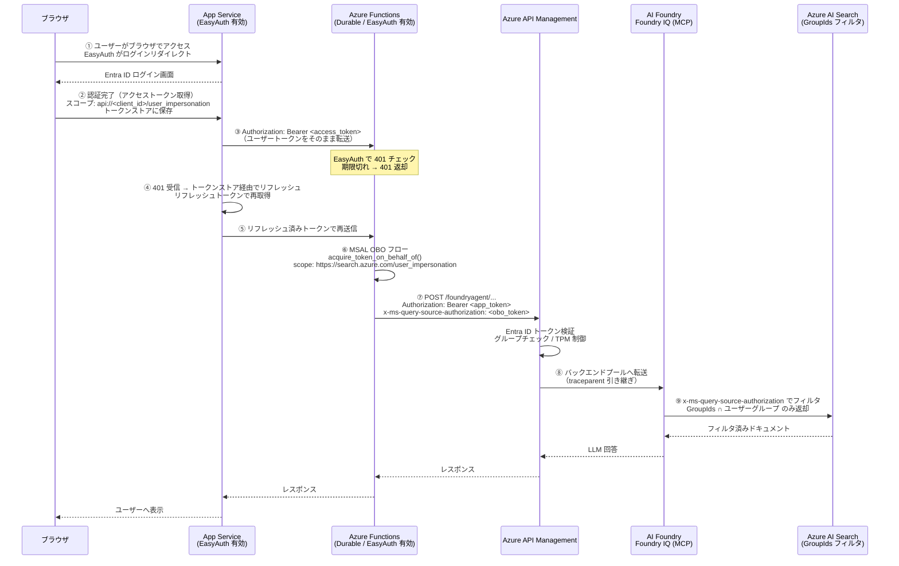

# ドキュメント ACL の OBO フロー実運用

## 概要

ハンズオンでは `az login` 済みユーザーの資格情報を使って OBO フローを手動実行しました。  
実運用では **App Service → Azure Functions（Durable）→ Foundry Agent API（APIM）** の構成でユーザートークンを安全に伝播させます。

---

## アーキテクチャ



---

## 各コンポーネントの設定ポイント

### App Service — EasyAuth の有効化

App Service に **Easy Auth（組み込み認証）** を有効化することで、ブラウザからのアクセスを Entra ID 認証にリダイレクトします。

> **ポイント**: ハンズオンで実施した「ユーザーへの同意付与」（`api://<client_id>/user_impersonation` スコープへの同意）は、App Service の EasyAuth でユーザーがブラウザ経由でログインする際に行われます。実運用では事前にテナント管理者が一括同意するか、ユーザーが初回ログイン時にブラウザで同意します。

**設定すべきスコープ（App Service の認証設定）:**

```
api://<AZURE_OBO_CLIENT_ID>/user_impersonation
https://search.azure.com/user_impersonation
```

### App Service — トークンストア設定

**トークンストア**を有効化することで、ユーザーのアクセストークンとリフレッシュトークンを App Service が管理します。

| 設定項目                     | 値           | 説明                   |
| ---------------------------- | ------------ | ---------------------- |
| `tokenStore.enabled`         | `true`       | トークンをストアに保存 |
| `tokenRefreshExtensionHours` | `72`（任意） | トークン有効期限の延長 |

**トークンリフレッシュの流れ:**

1. App Service が Functions に Bearer トークンを転送する
2. Functions の EasyAuth がトークン期限切れを検出し `401` を返す
3. App Service のトークンストアがリフレッシュトークンを使い新しいアクセストークンを取得する
4. App Service が再度 Functions にリクエストを送信する

この自動リフレッシュにより、アプリケーションコードでトークン有効期限を意識する必要がなくなります。

### Azure Functions — EasyAuth の有効化

Functions 側でも EasyAuth を有効化し、**期限切れトークンを拒否（401）** するように設定します。

```json
{
  "requireAuthentication": true,
  "unauthenticatedClientAction": "Return401"
}
```

> Functions が 401 を返すことで App Service のトークンストアによるリフレッシュが自動的にトリガーされます。

### Azure Functions — OBO フローの実装（マネージド ID フェデレーション）

ハンズオンではクライアントシークレットを使いましたが、実運用では **マネージド ID をフェデレーション資格情報（FIC）として使う**ことでシークレット管理を不要にできます。

`azure.identity.OnBehalfOfCredential` の `client_assertion_func` に、マネージド ID で取得したトークンを渡すことで実現します。

```python
from azure.identity import ManagedIdentityCredential, OnBehalfOfCredential

def exchange_token_for_search(user_assertion: str, client_id: str,
                               tenant_id: str) -> str:
    """マネージド ID フェデレーションで AI Search 用 OBO トークンを取得"""
    mi_credential = ManagedIdentityCredential()

    def get_mi_assertion() -> str:
        # マネージド ID で Entra ID 向けアサーションを取得
        token = mi_credential.get_token("api://AzureADTokenExchange")
        return token.token

    obo_credential = OnBehalfOfCredential(
        tenant_id=tenant_id,
        client_id=client_id,
        client_assertion_func=get_mi_assertion,  # ← シークレット不要
        user_assertion=user_assertion,            # EasyAuth から受け取ったトークン
    )
    token = obo_credential.get_token("https://search.azure.com/user_impersonation")
    return token.token
```

#### 事前設定（Entra ID アプリへの FIC 追加）

Functions のマネージド ID を Entra ID アプリの**フェデレーション ID 資格情報**として登録する必要があります。

```bash
# Functions のマネージド ID オブジェクト ID を取得
MI_OBJECT_ID=$(az functionapp identity show \
  --name <func-app-name> --resource-group <rg-name> \
  --query principalId -o tsv)

# Entra ID アプリに FIC を追加
az ad app federated-credential create \
  --id <AZURE_OBO_CLIENT_ID> \
  --parameters "{
    \"name\": \"func-managed-identity\",
    \"issuer\": \"https://login.microsoftonline.com/${AZURE_OBO_TENANT_ID}/v2.0\",
    \"subject\": \"${MI_OBJECT_ID}\",
    \"audiences\": [\"api://AzureADTokenExchange\"]
  }"
```

#### ハンズオンとの比較

| 観点             | ハンズオン（シークレット）               | 本番推奨（マネージド ID FIC）                                       |
| ---------------- | ---------------------------------------- | ------------------------------------------------------------------- |
| 認証方式         | `client_secret` をコードに渡す           | マネージド ID トークンをアサーションとして使用                      |
| シークレット管理 | ローテーションが必要                     | 不要（Azure が自動管理）                                            |
| コード変更       | `AZURE_OBO_CLIENT_SECRET` 環境変数が必要 | 環境変数不要（`AZURE_OBO_TENANT_ID` と `AZURE_OBO_CLIENT_ID` のみ） |
| ライブラリ       | `msal`                                   | `azure-identity`                                                    |

取得した OBO トークンは Foundry Agent API への呼び出し時に `x-ms-query-source-authorization` ヘッダーに設定します。

```python
mcp_tool = {
    "type": "mcp",
    "server_url": kb_acl_mcp_url,
    "project_connection_id": "foundryIQ-docsacl",
    "headers": {
        "x-ms-query-source-authorization": obo_token  # OBO トークン
    },
}
```

---

## トークンの流れまとめ

| ステップ                | トークン                     | スコープ                                      | 用途                              |
| ----------------------- | ---------------------------- | --------------------------------------------- | --------------------------------- |
| ブラウザ → App Service  | アクセストークン             | `api://<client_id>/user_impersonation`        | EasyAuth による認証               |
| App Service → Functions | 同上（転送）                 | 同上                                          | Functions の EasyAuth で検証      |
| Functions 内（OBO）     | OBO トークン                 | `https://search.azure.com/user_impersonation` | AI Search の GroupIds フィルタ    |
| Functions → APIM        | アプリトークン               | `https://ai.azure.com/`                       | APIM の Entra ID 検証             |
| APIM → Foundry          | OBO トークン（ヘッダー経由） | —                                             | `x-ms-query-source-authorization` |

---

## 次のステップ

- [セキュリティ — APIM ゲートウェイ制御と Foundry ガードレール](./02_security.md)
