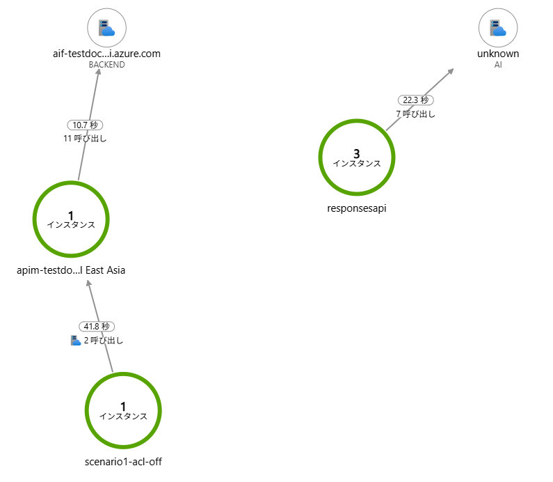
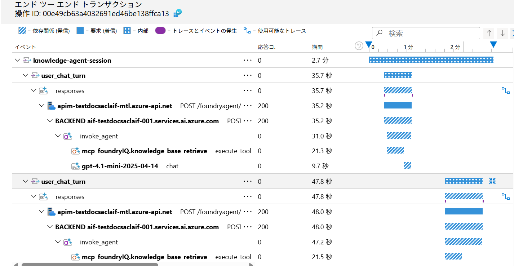
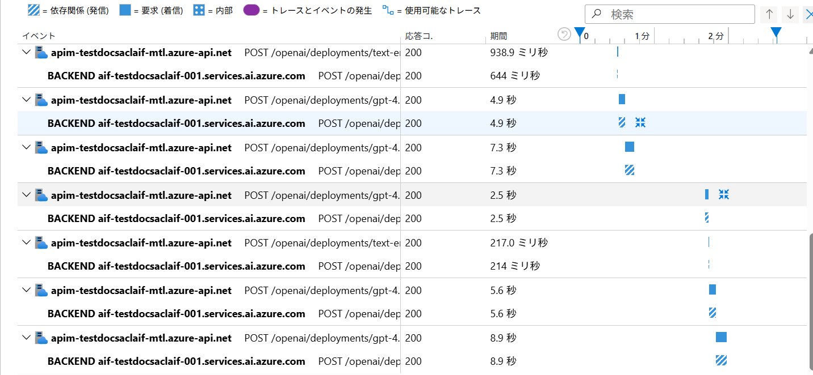
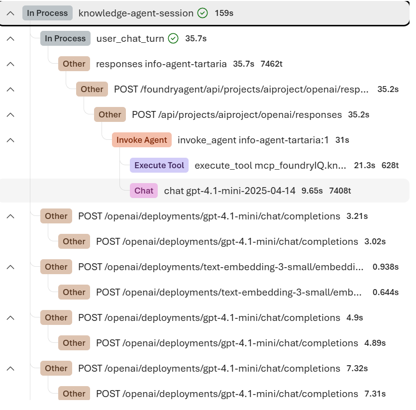

# シナリオ 1: ACL なし — Foundry Agent 経由

## 概要

Foundry Project に事前デプロイされたエージェント (`info-agent-tartaria`) をシンプルに呼び出します。
ACL は無効のため、すべてのドキュメントがナレッジベースから参照可能です。OBO フローは不要です。

**使用コード**: `appcodes/acl_off/`

---

## 処理フロー

```
クライアント (acl_off/main.py)
  │
  │  DefaultAzureCredential (az login 済みユーザー)
  ▼
Azure API Management
  │
  ▼
AI Foundry Project エンドポイント
  │  responses.create(model=agent_name, input=user_input)
  ▼
info-agent-tartaria (Foundry Agent)
  │  MCP ツール: knowledge_base_retrieve
  ▼
Foundry IQ (foundryIQ 接続)
  │
  ▼
kb-tartalia-noacl-gen2 (ナレッジベース)
  │  全ドキュメントを参照可能
  ▼
LLM が回答を生成して返却
```

---

## 環境変数

| 変数名              | 説明                                    | 例                                                               |
| ------------------- | --------------------------------------- | ---------------------------------------------------------------- |
| `PROJECT_ENDPOINT`  | AI Foundry Project のエンドポイント URL | `https://<foundry>.services.ai.azure.com/api/projects/aiproject` |
| `AGENT_NAME`        | 呼び出すエージェント名                  | `info-agent-tartaria`                                            |
| `OTEL_SERVICE_NAME` | OpenTelemetry サービス名                | `scenario1-acl-off`                                              |

---

## 手順

### Step 1: 環境変数を設定する

```bash
export PROJECT_ENDPOINT="$(azd env get-value PROJECT_ENDPOINT)"
export AGENT_NAME="info-agent-tartaria"
export OTEL_SERVICE_NAME="scenario1-acl-off"
```

### Step 2: アプリを実行する

```bash
cd appcodes
source .venv/bin/activate  # Windows: .venv\Scripts\activate
python acl_off/main.py
```

起動すると以下のように対話モードになります。

```
=== MS foundry 接続情報 ===
Project: https://...
...
============================================================
対話を開始します。終了するには 'exit', 'quit', 'q' を入力してください。
============================================================

質問を入力してください:
ユーザー:
```

### Step 3: 質問を入力して動作を確認する

ナレッジベースに格納されたドキュメント (Tartarian/ ディレクトリ配下のファイル) に関する質問を入力します。

```
ユーザー: タルタリアとはどんな文明ですか？
```

レスポンスには以下の情報が含まれます。

- **回答本文**: LLM がナレッジベースの内容を元に生成した回答
- **Response ID**: 後続ターンで会話を継続するために使用
- **トークン使用量**: `input_tokens` / `output_tokens` / `total_tokens`

### Step 4: 複数ターンの対話を試す

同一セッション内で続けて質問すると、`previous_response_id` が引き継がれ、会話コンテキストが維持されます。

```
ユーザー: もう少し詳しく教えてください
```

コンソール出力で `前回レスポンスID: <id>` と表示されることを確認します。

### Step 5: Application Insights でトレースを確認する

Azure ポータルで Application Insights を開きます。

#### アプリケーション マップ

左メニューの **アプリケーション マップ** を開くと、クライアントから APIM・AI Foundry までの呼び出し関係がグラフで可視化されます。



| ノード              | 役割                                |
| ------------------- | ----------------------------------- |
| `scenario1-acl-off` | ローカルクライアント (本アプリ)     |
| `apim-...`          | Azure API Management (ゲートウェイ) |
| `aif-...` (BACKEND) | AI Foundry エンドポイント           |
| `responsesapi`      | Foundry Agent の responses API      |

#### エンドツーエンド トランザクション

**調査 → トランザクションの検索** からトレースを選択すると、スパンの階層を確認できます。



主要なスパンの意味は以下の通りです。

| スパン名                                | 内容                            |
| --------------------------------------- | ------------------------------- |
| `knowledge-agent-session`               | セッション全体のルートスパン    |
| `user_chat_turn`                        | 1 回の質問応答のスパン          |
| `responses`                             | Foundry Agent への API 呼び出し |
| `invoke_agent`                          | エージェントの実行              |
| `execute_tool`                          | MCP ツールの呼び出し            |
| `mcp-foundryIQ.knowledge_base_retrieve` | ナレッジベースからの検索        |

APIM 経由の OpenAI 呼び出し（チャット・埋め込み）も個別のスパンとして記録されます。



`user_chat_turn` スパンには以下のカスタム属性が記録されます。

| 属性名 | 内容 |
|---|---|
| `gen_ai.prompt` | ユーザーの入力テキスト |
| `tokens.input` | 入力トークン数 |
| `tokens.output` | 出力トークン数 |
| `tokens.total` | 合計トークン数 |
| `tokens.input.cached` | キャッシュ済み入力トークン数 |
| `tokens.output.reasoning` | 推論トークン数 |

#### Foundry ポータルでの確認

AI Foundry ポータルの **トレース** からも同じ階層構造を確認できます。モデルごとのトークン使用量やレイテンシが視覚的に把握しやすくなっています。



### Step 6: 終了する

```
ユーザー: exit
```

---

## コード解説

### `acl_off/main.py`

```python
# Foundry Project に接続
project_client = AIProjectClient(endpoint=config.project_endpoint, credential=credential)

# Application Insights の接続文字列を取得してテレメトリを初期化
conn = project_client.connections.get(name=config.project_appins_connection_name, include_credentials=True)
tracer = modules.setup_telemetry(conn.credentials.api_key, credential)

# OpenAI クライアントを生成 (APIM 経由)
openai_client, http_client = modules.create_openai_client(config.project_endpoint, credential)
```

### `acl_off/modules/response_api.py` — エージェント呼び出し部分

```python
response = openai_client.responses.create(
    model=model_deployment,   # エージェント名を model に指定
    input=user_input,
    previous_response_id=previous_response_id  # 2ターン目以降
)
```

- `model` にエージェント名を渡すことで、Foundry Agent として呼び出されます
- エージェントが内部で MCP ツール (`knowledge_base_retrieve`) を使ってナレッジを検索します
- ACL トークンは不要です

### 分散トレースが実現できる理由

クライアントから AI Foundry までの全区間が 1 本のトレースとして Application Insights に記録されるのは、**W3C TraceContext (`traceparent` ヘッダー)** を全区間で引き継いでいるためです。

```
クライアント ──traceparent──▶ APIM ──traceparent──▶ AI Foundry
  (生成)                    (引き継ぎ・転送)         (記録)
```

**① クライアント側: traceparent の生成と注入**

`telemetry_utils.py` の `inject_traceparent()` が、OpenTelemetry の現在スパンから W3C 形式の `traceparent` ヘッダーを構築します。

```python
# telemetry_utils.py
def inject_traceparent(request: httpx.Request):
    current_span = trace.get_current_span()
    sc = current_span.get_span_context()
    if sc is not None and sc.is_valid:
        trace_id_hex = f"{sc.trace_id:032x}"
        span_id_hex  = f"{sc.span_id:016x}"
        request.headers["traceparent"] = f"00-{trace_id_hex}-{span_id_hex}-01"
```

この関数を httpx の `event_hooks` に登録することで、すべての HTTP リクエストに自動で `traceparent` が付与されます。

```python
# response_api.py
http_client = httpx.Client(event_hooks={"request": [inject_traceparent]})
```

`main.py` では `knowledge-agent-session` をルートスパン、`user_chat_turn` を子スパンとして開始しており、各リクエスト時点の `span_id` がヘッダーに反映されます。

```python
# main.py
with tracer.start_as_current_span("knowledge-agent-session"):   # ルートスパン
    # ... 内部で user_chat_turn スパンが開始される
```

**② APIM 側: W3C プロトコルで traceparent を転送**

APIM の診断設定で `http_correlation_protocol = "W3C"` を設定しているため、受け取った `traceparent` ヘッダーをそのまま後続の AI Foundry へのリクエストに引き継ぎます。

```hcl
# apim の診断設定 (Terraform)
http_correlation_protocol = "W3C"
```

**③ 結果: 全区間が同一 trace_id で紐づく**

クライアント・APIM・AI Foundry のすべてのスパンが同一の `trace_id` を持つため、Application Insights のエンドツーエンド トランザクション ビューで 1 本の連続したトレースとして表示されます。

## 次のシナリオ

ACL によるユーザーごとのドキュメントアクセス制御を体験するには、[シナリオ 2](./シナリオ2_ACLあり_FoundryIQ.md) に進んでください。

---

## 前の手順

- [ハンズオン トップ](./ハンズオン.md)
