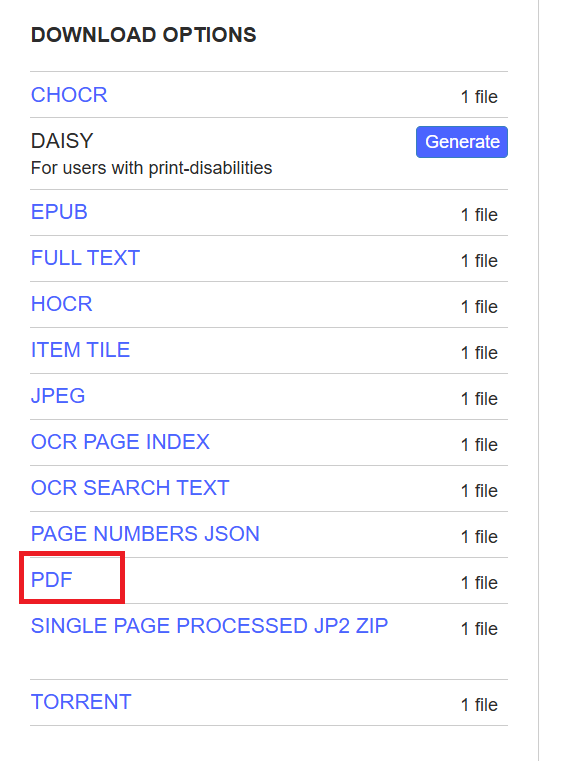
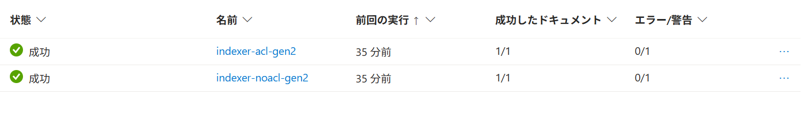

# 環境構築

## 前提条件

### 必要なツール

以下のツールをローカル環境にインストールしてください。

| ツール                                                                                                         | バージョン          | 説明                            |
| -------------------------------------------------------------------------------------------------------------- | ------------------- | ------------------------------- |
| [Azure CLI](https://learn.microsoft.com/ja-jp/cli/azure/install-azure-cli)                                     | 最新                | Azure リソース操作              |
| [Azure Developer CLI (azd)](https://learn.microsoft.com/ja-jp/azure/developer/azure-developer-cli/install-azd) | 最新                | インフラ一括デプロイ            |
| [Terraform](https://developer.hashicorp.com/terraform/install)                                                 | `>= 1.1.7, < 2.0.0` | IaC エンジン (azd が内部で使用) |
| [Python](https://www.python.org/downloads/)                                                                    | `>= 3.11`           | ハンズオンアプリの実行          |

### Azure サブスクリプション要件

- Azure サブスクリプション（オーナーロール）

## インフラのデプロイ

### Azure にログイン

```bash
az login
azd auth login
```

### `main.tfvars.json` の編集

`infra/main.tfvars.json` を開き、必要に応じて以下のパラメーターを変更します。

```json
{
  "location": "${AZURE_LOCATION}", // 編集不要
  "environment_name": "${AZURE_ENV_NAME}", // 編集不要
  "subscription_id": "${AZURE_SUBSCRIPTION_ID}", // 編集不要
  "ai_locations": ["westus"], // Foundry OpenAI モデルをデプロイするリージョン。検証用途のため、1つのみ指定でも問題ありません
  "openai_chat": {
    "model_name": "gpt-4.1-mini", // チャット用モデル名
    "model_version": "2025-04-14", // モデルのバージョン
    "deploy_type": "GlobalStandard", // モデルのデプロイタイプ
    "capacity": 5000 // TPM キャパシティ (単位: 千トークン)
  },
  "openai_embedding": {
    "model_name": "text-embedding-3-small", // 埋め込みモデル名
    "model_version": "1",
    "deploy_type": "Standard",
    "capacity": 230
  },
  "tpm_limit_token": 70000, // APIM で適用する TPM 上限
  "knowledge_reasoning_effort": "medium" // AI Search ナレッジ応答の推論レベル (low / medium / high)
}
```

> **注意**: `location`、`environment_name`、`subscription_id` の値は `${...}` 形式のままにしてください。azd がデプロイ時に自動で展開します。

### ハンズオン用ドキュメントの準備

ハンズオンでは AI Search にインデックスするサンプル PDF が必要です。

> **免責**: 以下のダウンロード手順はご自身の判断と責任において実施してください。

**手順**

1. [https://archive.org/details/one-world-tartarians_202304](https://archive.org/details/one-world-tartarians_202304) をブラウザで開きます。
2. PDF を開いて **4 ページ付近**に以下の記載があることを確認します。
   > _"This Book is Open Sourced to Download, Copy and Share / No copyrights reserved"_
3. ページ右側の **DOWNLOAD OPTIONS** から **PDF** をクリックしてダウンロードします。

   

4. ダウンロードした PDF を `infra/docs/` に配置します（ファイル名は任意）。

```bash
mv /path/to/<ダウンロードしたファイル名>.pdf infra/docs/
```

> `azd up` 実行時に `infra/docs/` 内のファイルが自動で AI Search にアップロードされます。

### デプロイ実行

```bash
azd up
```

> **エラーが発生した場合**: 一時的なタイムアウトや API の競合によりエラーが発生することがあります。その場合はもう一度 `azd up` を実行してください。

### デプロイ後の確認

`azd up` 完了後、Azure ポータルで AI Search の**インデクサー**が正常に実行されたことを確認してください。

**確認手順:**

1. Azure ポータルで、デプロイされた AI Search サービスを開く
2. 左メニューの **「インデクサー」** を開く
3. 以下の状態になっていることを確認する
   - **状態**: 成功
   - **ドキュメント数**: `1/1`



## 次のステップ

インフラのデプロイが完了したら、ハンズオンに進んでください。

→ **[ハンズオンを開始する](../ハンズオン/ハンズオン.md)**

---

## リソースの削除

ハンズオン終了後は以下のコマンドで全リソースを削除できます。

```bash
azd down
```

> **エラーが発生した場合**: エラーが発生した場合はもう一度 `azd down` を実行してください。

---
