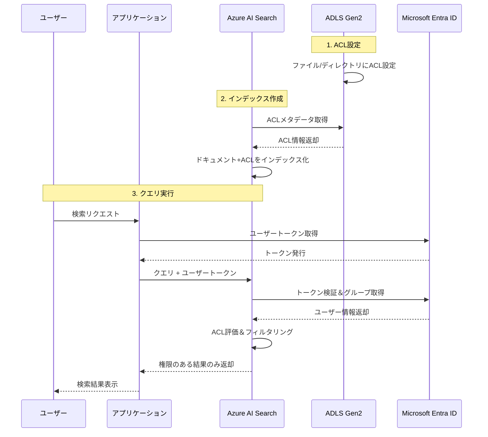

# Azure AI Search ドキュメントレベルアクセス制御ガイド

## 目次

1. [概要](#概要)
2. [Azure AI Search のドキュメントレベルアクセス制御](#azure-ai-searchのドキュメントレベルアクセス制御)
3. [Azure Data Lake Storage Gen2 とは](#azure-data-lake-storage-gen2とは)
4. [ACL（アクセス制御リスト）の詳細](#aclアクセス制御リストの詳細)
5. [ACL の作成方法](#aclの作成方法)
6. [マルチプロトコルアクセス](#マルチプロトコルアクセス)
7. [パフォーマンスと API 選択](#パフォーマンスとapi選択)
8. [ACL 評価順序](#acl評価順序)

---

## 概要

Azure AI Search では**ドキュメントごとにアクセス制御（RBAC/ACL）が可能**です。これにより、検索結果をユーザーの権限に基づいて自動的にフィルタリングできます。

---

## Azure AI Search のドキュメントレベルアクセス制御

### 主要な 3 つのアプローチ

#### 1. ネイティブ ACL/RBAC サポート（プレビュー）⭐ 推奨

**対応データソース:**

- ADLS Gen2 の POSIX-like ACL
- Azure ブロブストレージの RBAC スコープ
- SharePoint Microsoft 365 の ACL
- Microsoft Purview 機密ラベル

**動作:**

- インデックス作成時: ACL/RBAC メタデータを自動取得
- クエリ時: ユーザーの Microsoft Entra ID トークンで検証
- 結果: 権限のないドキュメントを自動除外

**必要な API:**

- REST API: `2025-05-01-preview` 以降
- Azure SDK: Python/NET/Java のプレリリース版

#### 2. セキュリティフィルタ（すべてのバージョンで利用可能）

**特徴:**

- 手動実装が必要だが最も柔軟
- カスタムセキュリティモデルに対応
- 文字列比較ベース

**実装例:**

```json
// インデックススキーマ
{
  "name": "group_ids",
  "type": "Collection(Edm.String)",
  "filterable": true
}

// クエリ時のフィルタ
{
  "filter": "group_ids/any(g:search.in(g, 'group_id1, group_id2'))"
}
```

---

## Azure Data Lake Storage Gen2 とは

### 定義

**ADLS Gen2 = 階層型名前空間（Hierarchical Namespace）を有効化した Azure Blob Storage**

### 主な特徴

| 項目               | 通常の Blob Storage     | ADLS Gen2                   |
| ------------------ | ----------------------- | --------------------------- |
| **ディレクトリ**   | 仮想（名前の一部）      | 実際のオブジェクト          |
| **リネーム**       | コピー＆削除            | メタデータ更新のみ          |
| **削除**           | 全 Blob 列挙が必要      | 単一アトミック操作          |
| **API**            | Blob API のみ           | Blob API + DFS API          |
| **ACL**            | コンテナレベルのみ      | ファイル/ディレクトリ単位   |
| **エンドポイント** | `blob.core.windows.net` | `dfs.core.windows.net` 追加 |

### ⚠️ 重要な注意点

- 階層型名前空間を**一度有効化したら無効化不可**
- ACL 設定には`dfs.core.windows.net`エンドポイントが必須

---

## Azure ブロブストレージの RBAC スコープ

### 概要

通常の Azure Blob Storage では**コンテナ単位**で RBAC ロールを割り当てますが、Azure AI Search に統合すると、その RBAC スコープ情報をインデックスに取り込み、**検索結果レベルでアクセス制御**できます。

### 主要ロール

- **Storage Blob Data Reader**: 読み取り専用
- **Storage Blob Data Contributor**: 読み書き
- **Storage Blob Data Owner**: フルアクセス

### 仕組み

```
1. インデックス作成時
   → コンテナのRBAC設定を取得
   → 各ドキュメントに権限メタデータを付与

2. クエリ時
   → x-ms-query-source-authorization ヘッダーでユーザートークン送信
   → ユーザーがストレージで持つ権限を検証
   → 権限のないドキュメントを自動除外
```

### ADLS Gen2 との違い

| 項目         | Blob Storage RBAC    | ADLS Gen2 ACL             |
| ------------ | -------------------- | ------------------------- |
| **スコープ** | コンテナ単位         | ファイル/ディレクトリ単位 |
| **粒度**     | すべての Blob に継承 | 個別設定可能              |
| **柔軟性**   | 低                   | 高                        |

---

## ACL（アクセス制御リスト）の詳細

### 権限の種類（RWX）

| 権限            | ファイル           | ディレクトリ                  |
| --------------- | ------------------ | ----------------------------- |
| **Read (R)**    | ファイル内容を読む | **R+X**でディレクトリ一覧表示 |
| **Write (W)**   | ファイルに書き込む | **W+X**で子アイテム作成       |
| **Execute (X)** | ファイルでは無意味 | トラバース（必須）            |

### 数値表記

- **7** = `rwx` (読み書き実行)
- **5** = `r-x` (読み取り実行)
- **4** = `r--` (読み取りのみ)
- **0** = `---` (権限なし)

### ACL 対象の ID（Microsoft Entra ID）

1. **所有ユーザー** (owning user)
2. **所有グループ** (owning group)
3. **名前付きユーザー** (named users)
4. **名前付きグループ** (named groups)
5. **サービスプリンシパル**
6. **マネージド ID**
7. **その他すべてのユーザー** (other)

### ACL 文字列フォーマット

```
# 基本形式
user::rwx,group::r-x,other::---,user:<ObjectID>:r-x

# 要素説明
user::         # 所有ユーザー
group::        # 所有グループ
other::        # その他すべて
user:<GUID>:   # 特定ユーザー
group:<GUID>:  # 特定グループ
default:       # デフォルトACL（新規ファイル継承用）
```

### ACL 設定例

```bash
# ディレクトリの例
user::rwx,group::r-x,other::---,user:xxxxxxxx-xxxx-xxxx-xxxx-xxxxxxxxxxxx:r-x

# 意味
# - 所有ユーザー: 読み書き実行 (rwx)
# - 所有グループ: 読み取り実行 (r-x)
# - その他: 権限なし (---)
# - 特定ユーザー: 読み取り実行 (r-x)
```

---

## ACL の作成方法

### 1. Azure CLI

#### ディレクトリの ACL 設定

```bash
az storage fs access set \
  --acl "user::rw-,group::rw-,other::-wx" \
  -p my-directory \
  -f my-file-system \
  --account-name mystorageaccount \
  --auth-mode login
```

#### 再帰的設定（サブディレクトリ含む）

```bash
az storage fs access set-recursive \
  --acl "user::rwx,group::r-x,other::---,user:xxxxxxxx-xxxx-xxxx-xxxx-xxxxxxxxxxxx:r-x" \
  -p my-parent-directory/ \
  -f my-container \
  --account-name mystorageaccount \
  --auth-mode login
```

#### デフォルト ACL 設定

```bash
az storage fs access set \
  --acl "default:user::rw-,group::rw-,other::-wx" \
  -p my-directory \
  -f my-file-system \
  --account-name mystorageaccount \
  --auth-mode login
```

### 2. Python SDK

#### セットアップ

```python
from azure.storage.filedatalake import DataLakeServiceClient
from azure.identity import DefaultAzureCredential

credential = DefaultAzureCredential()
service_client = DataLakeServiceClient(
    account_url="https://<storage-account-name>.dfs.core.windows.net",
    credential=credential
)
```

#### ディレクトリの ACL 設定

```python
def set_directory_acl():
    try:
        file_system_client = service_client.get_file_system_client(
            file_system="my-container"
        )
        directory_client = file_system_client.get_directory_client("my-directory")

        # ACL取得
        acl_props = directory_client.get_access_control()
        print(f"現在のACL: {acl_props['permissions']}")

        # ACL設定（簡易形式）
        new_dir_permissions = "rwxr-xrw-"
        directory_client.set_access_control(permissions=new_dir_permissions)

        print("ACL設定完了")

    except Exception as e:
        print(f"エラー: {e}")
```

#### 再帰的 ACL 設定

```python
def set_acl_recursively(is_default_scope=False):
    try:
        file_system_client = service_client.get_file_system_client(
            file_system="my-container"
        )
        directory_client = file_system_client.get_directory_client("my-parent-directory")

        # ACL定義
        acl = 'user::rwx,group::r-x,other::---,user:xxxxxxxx-xxxx-xxxx-xxxx-xxxxxxxxxxxx:r-x'

        # デフォルトACLの場合
        if is_default_scope:
            acl = 'default:user::rwx,default:group::r-x,default:other::---'

        # 再帰的に設定
        directory_client.set_access_control_recursive(acl=acl)

        print("再帰的ACL設定完了")

    except Exception as e:
        print(f"エラー: {e}")
```

### 3. PowerShell

```powershell
# 接続
Connect-AzAccount
$ctx = New-AzStorageContext -StorageAccountName '<storage-account-name>' -UseConnectedAccount

# ACLオブジェクト作成
$acl = Set-AzDataLakeGen2ItemAclObject -AccessControlType user -Permission rwx
$acl = Set-AzDataLakeGen2ItemAclObject -AccessControlType group -Permission r-x -InputObject $acl
$acl = Set-AzDataLakeGen2ItemAclObject -AccessControlType other -Permission --- -InputObject $acl

# ディレクトリに適用
Update-AzDataLakeGen2Item -Context $ctx -FileSystem "my-container" -Path "my-directory" -Acl $acl
```

### ユーザー/グループ ID の取得

```bash
# ユーザーのObject ID取得
az ad user show --id user@example.com --query objectId -o tsv

# グループのObject ID取得
az ad group show --group "GroupName" --query objectId -o tsv

# サービスプリンシパルのObject ID取得
az ad sp show --id <App-ID> --query objectId -o tsv
```

### ベストプラクティス

1. **グループベースで管理**: 個別ユーザーではなく Microsoft Entra ID セキュリティグループを使用
2. **再帰的設定**: 既存のディレクトリ階層全体に適用する場合は`set-recursive`
3. **デフォルト ACL**: 新規作成されるファイルに自動適用したい場合は`default:`プレフィックス
4. **最小権限の原則**: 必要最小限の権限のみ付与

---

## マルチプロトコルアクセス

### 両方のエンドポイントが使える

階層型名前空間を有効化すると、**2 つのエンドポイント**が利用可能：

```
blob.core.windows.net  → Blob API（従来型）
dfs.core.windows.net   → Data Lake Storage API（ADLS Gen2専用）
```

### `blob.core.windows.net`での動作

**✅ 階層型 NS の恩恵を受けられる:**

- ディレクトリが実際のオブジェクトとして存在
- ディレクトリ削除が単一のアトミック操作
- リネームが効率的（コピー不要）
- ACL が適用される（Blob API 経由でも ACL ベースのアクセス制御が有効）

**❌ 制約:**

- ACL の設定/取得は`blob.core.windows.net`経由では不可
- 一部の高度なディレクトリ操作は非効率
- 既存の Blob API を使うアプリは修正なしで動作するが、最適化されていない

### 使い分け

| エンドポイント          | 用途                 | 推奨ケース                                   |
| ----------------------- | -------------------- | -------------------------------------------- |
| `blob.core.windows.net` | 汎用 Blob 操作       | 既存アプリの互換性維持、Blob Storage 機能    |
| `dfs.core.windows.net`  | ファイルシステム操作 | ACL 設定、Hadoop/Spark、ディレクトリ操作多数 |

### コード例

```python
# 同じデータに両方でアクセス可能
blob_url = "https://mystorageaccount.blob.core.windows.net/mycontainer/myfile.txt"
dfs_url = "https://mystorageaccount.dfs.core.windows.net/mycontainer/myfile.txt"

# ❌ Blob APIではACL設定不可
# blob_client = BlobServiceClient(...)

# ✅ Data Lake Storage APIでACL設定
service_client = DataLakeServiceClient(
    account_url="https://mystorageaccount.dfs.core.windows.net",
    credential=credential
)
```

---

## パフォーマンスと API 選択

### 「修正なしで動作するが、最適化されていない」とは？

#### 🔴 問題 1: ディレクトリのリネームが非効率

**Blob API 使用（最適化されていない）:**

```python
# 数百万個のファイル × (コピー + 削除)
# 処理時間: 数時間～数日
```

**Data Lake Storage API 使用（最適化）:**

```python
directory_client.rename_directory(new_name="newdir")
# メタデータ更新 1回
# 処理時間: 数秒
```

#### 🔴 問題 2: ディレクトリの削除が非効率

**Blob API:**

```python
# 100万ファイル × 削除API呼び出し = 非常に遅い
for blob in container_client.list_blobs(name_starts_with="mydir/"):
    blob_client.delete_blob(blob.name)
```

**Data Lake Storage API:**

```python
# 単一のアトミック操作 = 瞬時
directory_client.delete_directory()
```

#### 🔴 問題 3: ACL 機能が使えない

**Blob API:**

```python
# ❌ ACL設定APIが存在しない
```

**Data Lake Storage API:**

```python
# ✅ ACL設定が可能
file_client.set_access_control(
    permissions="rwxr-xr--",
    acl="user::rwx,group::r-x,other::r--"
)
```

### パフォーマンス比較例（Spark ジョブ）

**従来の Blob API 使用:**

```
ジョブ実行時間: 10分
リネーム操作: 2時間  ← ボトルネック
合計: 2時間10分
```

**Data Lake Storage API 使用:**

```
ジョブ実行時間: 10分
リネーム操作: 2秒
合計: 10分2秒
```

### まとめ

**✅ 動作する部分:**

- 既存の Blob API コードはそのまま動く
- ファイルの読み書きは問題なし
- 後方互換性が保たれている

**❌ 最適化されていない部分:**

- ディレクトリ操作が依然として非効率（全ファイル列挙が必要）
- ACL 機能が使えない
- アトミック操作の恩恵を受けられない
- ビッグデータ処理で大幅な時間ロス

**推奨:**

- 新規開発: Data Lake Storage API（`dfs.core.windows.net`）を使う
- 既存アプリ: 動作するが、ディレクトリ操作が多い場合は移行を検討

---

## ACL 評価順序

### 基本評価順序

アクセス権限は以下の順序で評価され、**最初にマッチした権限が適用**されます：

1. **Superuser（スーパーユーザー）** ⭐ 最優先

   - すべてのファイル・ディレクトリに`rwx`権限

2. **Owning user（所有ユーザー）**

   - ファイル/ディレクトリの作成者

3. **Named user, service principal, managed identity**

   - 明示的に指定されたユーザー・SP・MI
   - 例: `user:xxxxxxxx-xxxx-xxxx-xxxx-xxxxxxxxxxxx:r-x`

4. **Owning group or named group（グループ）**

   - 所有グループまたは明示的に指定されたグループ
   - **特殊ルール**: 複数グループの場合、必要な権限が得られるまで**すべて評価**

5. **All other users（その他すべて）**
   - 上記のいずれにも該当しない場合
   - `other::`の権限が適用

### 重要なルール

#### ⚠️ 最初のマッチで決定

```
ユーザーが「所有ユーザー」かつ「名前付きユーザー」の両方に該当
→ 「所有ユーザー」の権限が適用（名前付きユーザーは無視）
```

#### ✅ グループは例外的に全評価

```
ユーザーが複数のグループに所属
→ すべてのグループの権限を評価
→ 必要な権限が得られるまで続ける
→ どのグループでも権限が得られなければ「other」へ
```

### 評価アルゴリズム（疑似コード）

```python
def evaluate_acl_permission(user, operation, file_acl):
    # 1. Superuser チェック
    if user.is_superuser:
        return GRANT  # rwx

    # 2. Owning user チェック
    if user == file_acl.owning_user:
        return file_acl.owning_user_permissions

    # 3. Named user チェック
    for named_user in file_acl.named_users:
        if user == named_user:
            return apply_mask(named_user.permissions)

    # 4. Groups チェック（複数グループを評価）
    for group in user.groups:
        if group == file_acl.owning_group:
            if check_permission(apply_mask(owning_group.permissions), operation):
                return GRANT
        for named_group in file_acl.named_groups:
            if group == named_group:
                if check_permission(apply_mask(named_group.permissions), operation):
                    return GRANT

    # 5. Other チェック
    return file_acl.other_permissions
```

### 実例

**ACL 設定:**

```
user::rwx              # 所有ユーザー: 読み書き実行
user:alice-id:r-x      # Aliceユーザー: 読み取り実行
group::r-x             # 所有グループ: 読み取り実行
group:dev-group-id:rw- # devグループ: 読み書き
other::---             # その他: 権限なし
```

**ケース 1: Alice が所有ユーザー**

```
結果: rwx （所有ユーザーの権限）
理由: 名前付きユーザー(r-x)より所有ユーザーが優先
```

**ケース 2: Bob が dev グループと read グループ両方に所属**

```
devグループ: rw-
readグループ: r--

Bob が書き込み操作を試行
→ devグループで rw- が見つかる → GRANT

Bob が実行操作を試行
→ devグループで rw- にXがない
→ readグループでも r-- にXがない → DENY
```

### RBAC との統合

実際の評価では、**RBAC → ABAC → ACL**の順序：

```
1. Azure RBACロール割り当てをチェック
   ↓ あれば許可、なければ次へ

2. ABACロール条件をチェック（条件付きロール）
   ↓ 条件マッチで許可、しなければ次へ

3. ACLをチェック（上記の1-5の順序）
   ↓ ACLで許可されれば許可、されなければ拒否
```

### ⚠️ 重要な注意点

> **ACL で RBAC を制限することはできません**
>
> RBAC で許可されている場合、ACL は評価されません

### マスクの影響

**Mask（マスク）**は、名前付きユーザー・名前付きグループ・所有グループに対してのみ適用：

```
user:alice-id:rwx  # Aliceに設定された権限
mask::r-x          # マスク

実効権限 = rwx & r-x = r-x（書き込み権限が除外）
```

---

## Azure AI Search での実装例

### インデックス作成（ADLS Gen2 ACL 取り込み）

```python
from azure.search.documents.indexes import SearchIndexerClient
from azure.identity import DefaultAzureCredential

credential = DefaultAzureCredential()
indexer_client = SearchIndexerClient(
    endpoint="https://<search-service>.search.windows.net",
    credential=credential
)

# ADLS Gen2データソース作成（プレビューAPI使用）
data_source = {
    "name": "adls-gen2-datasource",
    "type": "azuredatalakestorage",
    "credentials": {
        "connectionString": None  # マネージドID使用
    },
    "container": {
        "name": "my-container",
        "query": None
    },
    # ACL取り込み設定
    "dataChangeDetectionPolicy": None,
    "dataDeletionDetectionPolicy": None
}

# インデックススキーマ（権限フィルタフィールド含む）
index_schema = {
    "name": "my-index",
    "fields": [
        {"name": "id", "type": "Edm.String", "key": True},
        {"name": "content", "type": "Edm.String", "searchable": True},
        # 権限フィルタフィールド（自動生成）
        {"name": "permissions", "type": "Collection(Edm.String)", "filterable": True}
    ],
    # 権限フィルタを有効化
    "permissionFilters": {
        "enabled": True
    }
}
```

### クエリ時（ユーザー権限でフィルタリング）

```python
from azure.search.documents import SearchClient

search_client = SearchClient(
    endpoint="https://<search-service>.search.windows.net",
    index_name="my-index",
    credential=credential
)

# ユーザートークンを取得
user_token = get_user_entra_id_token()

# クエリ実行（権限フィルタ適用）
results = search_client.search(
    search_text="my query",
    # ユーザートークンをヘッダーに追加
    headers={
        "x-ms-query-source-authorization": f"Bearer {user_token}"
    }
)

# 権限のあるドキュメントのみが返される
for result in results:
    print(result)
```

---

## Azure AI Search と ADLS Gen2 ACL の連携設定（完全ガイド）

### 前提条件

#### 1. 必要な環境

- **Azure AI Search**: Basic tier 以上（Managed Identity 対応）
- **ADLS Gen2**: 階層型名前空間が有効化されたストレージアカウント
- **API バージョン**: `2025-05-01-preview` 以降
- **認証**: Microsoft Entra ID（Azure AD）

#### 2. 権限設定

**Azure AI Search のマネージドアイデンティティに付与:**

```bash
# Storage Blob Data Readerロールを付与
az role assignment create \
  --role "Storage Blob Data Reader" \
  --assignee <search-service-principal-id> \
  --scope /subscriptions/<subscription-id>/resourceGroups/<rg-name>/providers/Microsoft.Storage/storageAccounts/<storage-account-name>
```

**検索サービスの設定:**

```bash
# RBACを有効化
az search service update \
  --name <search-service-name> \
  --resource-group <rg-name> \
  --auth-options aadOrApiKey

# マネージドアイデンティティを有効化（システム割り当て）
az search service update \
  --name <search-service-name> \
  --resource-group <rg-name> \
  --identity-type SystemAssigned
```

---

### ステップ 1: ADLS Gen2 で ACL を設定

#### Python SDK で ACL 設定

```python
from azure.storage.filedatalake import DataLakeServiceClient
from azure.identity import DefaultAzureCredential

# 接続
credential = DefaultAzureCredential()
service_client = DataLakeServiceClient(
    account_url="https://<storage-account>.dfs.core.windows.net",
    credential=credential
)

# ファイルシステムとディレクトリを取得
file_system_client = service_client.get_file_system_client("my-container")
directory_client = file_system_client.get_directory_client("documents")

# グループIDを取得（Azure CLI）
# az ad group show --group "Marketing-Team" --query id -o tsv

# ACLを設定
acl = (
    "user::rwx,"                                                    # 所有者
    "group::r-x,"                                                   # 所有グループ
    "group:12345678-1234-1234-1234-123456789abc:r-x,"             # Marketing Team
    "group:87654321-4321-4321-4321-cba987654321:r--,"             # Sales Team
    "other::---"                                                    # その他
)

# 再帰的に設定（サブディレクトリ含む）
directory_client.set_access_control_recursive(acl=acl)
print("ACL設定完了")
```

#### Azure CLI で ACL 設定

```bash
# 再帰的にACL設定
az storage fs access set-recursive \
  --acl "user::rwx,group::r-x,group:12345678-1234-1234-1234-123456789abc:r-x,other::---" \
  -p documents/ \
  -f my-container \
  --account-name <storage-account> \
  --auth-mode login
```

---

### ステップ 2: Azure AI Search インデックスを作成

#### REST API（2025-05-01-preview）

```bash
# インデックス作成
curl -X PUT "https://<search-service>.search.windows.net/indexes/my-index?api-version=2025-05-01-preview" \
  -H "Content-Type: application/json" \
  -H "api-key: <admin-key>" \
  -d '{
    "name": "my-index",
    "fields": [
      {
        "name": "document_id",
        "type": "Edm.String",
        "key": true,
        "searchable": false
      },
      {
        "name": "content",
        "type": "Edm.String",
        "searchable": true,
        "analyzer": "ja.microsoft"
      },
      {
        "name": "metadata_storage_path",
        "type": "Edm.String",
        "searchable": false,
        "filterable": true
      }
    ],
    "permissionFilters": {
      "enabled": true,
      "aclFields": [
        {
          "name": "acl_permissions",
          "type": "acl"
        }
      ]
    }
  }'
```

#### Python SDK（プレリリース版）

```python
from azure.search.documents.indexes import SearchIndexClient
from azure.search.documents.indexes.models import (
    SearchIndex,
    SimpleField,
    SearchableField,
    SearchFieldDataType,
    PermissionFilter
)
from azure.identity import DefaultAzureCredential

credential = DefaultAzureCredential()
index_client = SearchIndexClient(
    endpoint="https://<search-service>.search.windows.net",
    credential=credential
)

# インデックス定義
index = SearchIndex(
    name="my-index",
    fields=[
        SimpleField(name="document_id", type=SearchFieldDataType.String, key=True),
        SearchableField(name="content", type=SearchFieldDataType.String, analyzer_name="ja.microsoft"),
        SimpleField(name="metadata_storage_path", type=SearchFieldDataType.String, filterable=True)
    ],
    # 権限フィルタを有効化
    permission_filters=PermissionFilter(
        enabled=True,
        acl_fields=[
            {
                "name": "acl_permissions",
                "type": "acl"
            }
        ]
    )
)

# インデックス作成
index_client.create_or_update_index(index)
print("インデックス作成完了")
```

---

### ステップ 3: データソースとインデクサーを作成

#### REST API（データソース作成）

```bash
curl -X PUT "https://<search-service>.search.windows.net/datasources/adls-gen2-datasource?api-version=2025-05-01-preview" \
  -H "Content-Type: application/json" \
  -H "api-key: <admin-key>" \
  -d '{
    "name": "adls-gen2-datasource",
    "type": "azuredatalakestorage",
    "credentials": {
      "connectionString": null
    },
    "container": {
      "name": "my-container",
      "query": "documents/"
    },
    "identity": {
      "@odata.type": "#Microsoft.Azure.Search.DataSystemAssignedIdentity"
    }
  }'
```

#### REST API（インデクサー作成・ACL 取り込み設定）

```bash
curl -X PUT "https://<search-service>.search.windows.net/indexers/adls-gen2-indexer?api-version=2025-05-01-preview" \
  -H "Content-Type: application/json" \
  -H "api-key: <admin-key>" \
  -d '{
    "name": "adls-gen2-indexer",
    "dataSourceName": "adls-gen2-datasource",
    "targetIndexName": "my-index",
    "schedule": {
      "interval": "PT2H"
    },
    "parameters": {
      "configuration": {
        "parsingMode": "default",
        "dataToExtract": "contentAndMetadata",
        "ingestionPermissionOptions": "acl"
      }
    },
    "fieldMappings": [
      {
        "sourceFieldName": "metadata_storage_path",
        "targetFieldName": "document_id",
        "mappingFunction": {
          "name": "base64Encode"
        }
      }
    ]
  }'
```

**重要な設定項目:**

- `"ingestionPermissionOptions": "acl"` - ACL メタデータを取り込む
- `"identity"` - マネージドアイデンティティを使用
- `"type": "azuredatalakestorage"` - ADLS Gen2 データソースを指定

#### Python SDK（データソースとインデクサー）

```python
from azure.search.documents.indexes import SearchIndexerClient
from azure.search.documents.indexes.models import (
    SearchIndexerDataSourceConnection,
    SearchIndexer,
    FieldMapping,
    IndexingParameters
)

indexer_client = SearchIndexerClient(
    endpoint="https://<search-service>.search.windows.net",
    credential=credential
)

# データソース作成
data_source = SearchIndexerDataSourceConnection(
    name="adls-gen2-datasource",
    type="azuredatalakestorage",
    connection_string=None,  # マネージドID使用
    container={"name": "my-container", "query": "documents/"}
)
indexer_client.create_or_update_data_source_connection(data_source)

# インデクサー作成（ACL取り込み設定）
indexer = SearchIndexer(
    name="adls-gen2-indexer",
    data_source_name="adls-gen2-datasource",
    target_index_name="my-index",
    parameters=IndexingParameters(
        configuration={
            "parsingMode": "default",
            "dataToExtract": "contentAndMetadata",
            "ingestionPermissionOptions": "acl"  # ACL取り込みを有効化
        }
    ),
    field_mappings=[
        FieldMapping(
            source_field_name="metadata_storage_path",
            target_field_name="document_id",
            mapping_function={"name": "base64Encode"}
        )
    ]
)
indexer_client.create_or_update_indexer(indexer)
print("インデクサー作成完了")

# インデクサーを実行
indexer_client.run_indexer("adls-gen2-indexer")
print("インデックス作成開始")
```

---

### ステップ 4: クエリ時の権限フィルタリング

#### Python SDK

```python
from azure.search.documents import SearchClient
from azure.identity import DefaultAzureCredential, get_bearer_token_provider

# 認証
credential = DefaultAzureCredential()

# ユーザートークンプロバイダー作成
token_provider = get_bearer_token_provider(
    credential,
    "https://search.azure.com/.default"
)

# SearchClient作成
search_client = SearchClient(
    endpoint="https://<search-service>.search.windows.net",
    index_name="my-index",
    credential=credential
)

# ユーザーのEntra IDトークンを取得
user_token = credential.get_token("https://storage.azure.com/.default").token

# クエリ実行（ACLフィルタ適用）
results = search_client.search(
    search_text="マーケティング資料",
    # ユーザートークンをヘッダーに追加
    headers={
        "x-ms-query-source-authorization": f"Bearer {user_token}"
    },
    select=["document_id", "content", "metadata_storage_path"],
    top=10
)

# 権限のあるドキュメントのみが返される
for result in results:
    print(f"Document: {result['document_id']}")
    print(f"Content: {result['content'][:100]}...")
    print(f"Path: {result['metadata_storage_path']}")
    print("-" * 80)
```

#### REST API

```bash
# ユーザートークンを取得
USER_TOKEN=$(az account get-access-token --resource https://storage.azure.com --query accessToken -o tsv)

# クエリ実行
curl -X POST "https://<search-service>.search.windows.net/indexes/my-index/docs/search?api-version=2025-05-01-preview" \
  -H "Content-Type: application/json" \
  -H "api-key: <query-key>" \
  -H "x-ms-query-source-authorization: Bearer $USER_TOKEN" \
  -d '{
    "search": "マーケティング資料",
    "select": "document_id,content,metadata_storage_path",
    "top": 10
  }'
```

---

### ステップ 5: クライアントユーザーのトークン取得と使用

実際のアプリケーションでは、**エンドユーザー（クライアント）のトークン**を取得して`x-ms-query-source-authorization`ヘッダーに渡す必要があります。

#### シナリオ 1: Web アプリケーション（On-Behalf-Of フロー）

**アーキテクチャ:**

```
エンドユーザー → フロントエンド → バックエンドAPI → Azure AI Search
```

##### フロントエンド（JavaScript/React）

```javascript
// Microsoft Authentication Library (MSAL) を使用
import { PublicClientApplication } from "@azure/msal-browser";

const msalConfig = {
  auth: {
    clientId: "<your-client-id>",
    authority: "https://login.microsoftonline.com/<tenant-id>",
    redirectUri: "http://localhost:3000",
  },
};

const msalInstance = new PublicClientApplication(msalConfig);

// ユーザーのトークンを取得
async function getUserToken() {
  const accounts = msalInstance.getAllAccounts();

  if (accounts.length === 0) {
    // ログインが必要
    await msalInstance.loginPopup({
      scopes: ["https://storage.azure.com/.default"],
    });
  }

  // トークンを取得（キャッシュから、または更新）
  const tokenResponse = await msalInstance.acquireTokenSilent({
    scopes: ["https://storage.azure.com/.default"],
    account: accounts[0],
  });

  return tokenResponse.accessToken;
}

// バックエンドAPIに検索リクエスト
async function searchDocuments(query) {
  const userToken = await getUserToken();

  const response = await fetch("https://your-backend-api.com/api/search", {
    method: "POST",
    headers: {
      "Content-Type": "application/json",
      Authorization: `Bearer ${userToken}`, // バックエンドに渡す
    },
    body: JSON.stringify({ query }),
  });

  return response.json();
}
```

##### バックエンド（Python/Flask）

```python
from flask import Flask, request, jsonify
from azure.search.documents import SearchClient
from azure.identity import DefaultAzureCredential
import jwt
import requests

app = Flask(__name__)

# Azure AI Search クライアント（アプリケーション認証）
search_credential = DefaultAzureCredential()
search_client = SearchClient(
    endpoint="https://<search-service>.search.windows.net",
    index_name="my-index",
    credential=search_credential
)

@app.route("/api/search", methods=["POST"])
def search():
    # フロントエンドから受け取ったユーザートークン
    auth_header = request.headers.get("Authorization")
    if not auth_header or not auth_header.startswith("Bearer "):
        return jsonify({"error": "Missing or invalid authorization header"}), 401

    user_token = auth_header.split("Bearer ")[1]

    # トークンを検証（オプションだが推奨）
    try:
        # JWTをデコードして検証
        decoded = jwt.decode(
            user_token,
            options={"verify_signature": False},  # 本番環境では署名検証を実施
            audience="https://storage.azure.com"
        )
        print(f"User: {decoded.get('preferred_username')}")
    except jwt.InvalidTokenError as e:
        return jsonify({"error": "Invalid token"}), 401

    # 検索クエリ実行（ユーザートークンを渡す）
    query_text = request.json.get("query", "")

    results = search_client.search(
        search_text=query_text,
        headers={
            "x-ms-query-source-authorization": f"Bearer {user_token}"
        },
        select=["document_id", "content", "metadata_storage_path"],
        top=10
    )

    # 結果を返却
    documents = []
    for result in results:
        documents.append({
            "id": result["document_id"],
            "content": result["content"],
            "path": result["metadata_storage_path"]
        })

    return jsonify({"results": documents})

if __name__ == "__main__":
    app.run(debug=True)
```

#### シナリオ 1b: Python Web アプリでブラウザリダイレクト（Flask + MSAL）

**✅ 推奨**: Python の Web アプリケーションで Entra ID にリダイレクトしてユーザー認証を行う方法。

##### インストール

```bash
pip install flask msal identity
```

##### Flask アプリケーション（完全な例）

```python
from flask import Flask, redirect, url_for, session, request, jsonify
from msal import ConfidentialClientApplication
from azure.search.documents import SearchClient
from azure.core.credentials import AzureKeyCredential
import os

app = Flask(__name__)
app.secret_key = os.urandom(24)  # セッション管理用

# Azure AD設定
CLIENT_ID = "<your-client-id>"
CLIENT_SECRET = "<your-client-secret>"
TENANT_ID = "<your-tenant-id>"
AUTHORITY = f"https://login.microsoftonline.com/{TENANT_ID}"
REDIRECT_PATH = "/auth/callback"  # このパスをAzure ADに登録
SCOPE = ["https://storage.azure.com/.default"]

# MSALアプリケーション
msal_app = ConfidentialClientApplication(
    CLIENT_ID,
    authority=AUTHORITY,
    client_credential=CLIENT_SECRET
)

# Azure AI Search設定
SEARCH_ENDPOINT = "https://<search-service>.search.windows.net"
SEARCH_INDEX = "my-index"
SEARCH_API_KEY = "<admin-or-query-key>"


@app.route("/")
def index():
    """トップページ"""
    if not session.get("user"):
        return '''
            <h1>Azure AI Search with ACL Demo</h1>
            <a href="/login">Entra IDでログイン</a>
        '''

    user = session.get("user")
    return f'''
        <h1>ようこそ、{user.get("name")}さん</h1>
        <form action="/search" method="get">
            <input type="text" name="q" placeholder="検索キーワード" required>
            <button type="submit">検索</button>
        </form>
        <br>
        <a href="/logout">ログアウト</a>
    '''


@app.route("/login")
def login():
    """Entra IDログインページへリダイレクト"""
    # 認証URLを生成
    auth_url = msal_app.get_authorization_request_url(
        scopes=SCOPE,
        redirect_uri=url_for("auth_callback", _external=True)
    )
    return redirect(auth_url)


@app.route(REDIRECT_PATH)
def auth_callback():
    """Entra IDからのコールバック"""
    # 認証コードを取得
    code = request.args.get("code")
    if not code:
        return "認証に失敗しました", 400

    # トークンを取得
    result = msal_app.acquire_token_by_authorization_code(
        code,
        scopes=SCOPE,
        redirect_uri=url_for("auth_callback", _external=True)
    )

    if "error" in result:
        return f"トークン取得エラー: {result.get('error_description')}", 400

    # セッションに保存
    session["user"] = {
        "name": result.get("id_token_claims", {}).get("name", "Unknown"),
        "username": result.get("id_token_claims", {}).get("preferred_username"),
        "access_token": result.get("access_token")
    }

    return redirect(url_for("index"))


@app.route("/search")
def search():
    """検索実行"""
    if not session.get("user"):
        return redirect(url_for("login"))

    query = request.args.get("q", "")
    if not query:
        return "検索キーワードを入力してください", 400

    # ユーザートークンを取得
    user_token = session["user"]["access_token"]

    # Azure AI Searchで検索
    search_client = SearchClient(
        endpoint=SEARCH_ENDPOINT,
        index_name=SEARCH_INDEX,
        credential=AzureKeyCredential(SEARCH_API_KEY)
    )

    try:
        results = search_client.search(
            search_text=query,
            headers={
                "x-ms-query-source-authorization": f"Bearer {user_token}"
            },
            select=["document_id", "content", "metadata_storage_path"],
            top=10
        )

        # 結果を整形
        documents = []
        for result in results:
            documents.append({
                "id": result.get("document_id"),
                "content": result.get("content", "")[:200] + "...",
                "path": result.get("metadata_storage_path")
            })

        return jsonify({
            "query": query,
            "user": session["user"]["username"],
            "results": documents,
            "count": len(documents)
        })

    except Exception as e:
        return jsonify({"error": str(e)}), 500


@app.route("/logout")
def logout():
    """ログアウト"""
    session.clear()
    # Entra IDからもログアウト（オプション）
    return redirect(
        f"https://login.microsoftonline.com/{TENANT_ID}/oauth2/v2.0/logout"
        f"?post_logout_redirect_uri={url_for('index', _external=True)}"
    )


if __name__ == "__main__":
    app.run(debug=True, port=5000)
```

##### Azure AD アプリ登録設定

```bash
# アプリ登録
az ad app create \
  --display-name "MySearchApp-Web" \
  --sign-in-audience AzureADMyOrg \
  --web-redirect-uris "http://localhost:5000/auth/callback"

# クライアントシークレット作成
az ad app credential reset \
  --id <app-id> \
  --append

# APIパーミッション追加
az ad app permission add \
  --id <app-id> \
  --api https://storage.azure.com \
  --api-permissions e03f9065-8a8e-4d8e-b66d-66c01c5d4568=Scope  # user_impersonation

# 管理者の同意（必要に応じて）
az ad app permission admin-consent --id <app-id>
```

##### 📚 API パーミッション追加コマンドの詳細解説

```bash
az ad app permission add \
  --id <app-id> \
  --api https://storage.azure.com \
  --api-permissions e03f9065-8a8e-4d8e-b66d-66c01c5d4568=Scope
```

**各パラメータの意味:**

| パラメータ          | 値                                           | 説明                                                   |
| ------------------- | -------------------------------------------- | ------------------------------------------------------ |
| `--id`              | `<app-id>`                                   | 権限を付与するアプリケーション（クライアント）ID       |
| `--api`             | `https://storage.azure.com`                  | アクセスしたいリソース API（この場合は Azure Storage） |
| `--api-permissions` | `e03f9065-8a8e-4d8e-b66d-66c01c5d4568=Scope` | 権限 ID=権限タイプ                                     |

**権限の詳細:**

1. **API: `https://storage.azure.com`**

   - Azure Storage（Blob Storage、ADLS Gen2 含む）の API
   - この API にアクセスするための権限を要求

2. **Permission ID: `e03f9065-8a8e-4d8e-b66d-66c01c5d4568`**

   - これは`user_impersonation`スコープの一意識別子（GUID）
   - Azure Storage が定義している固定の ID

3. **Permission Type: `Scope`**

   - `Scope`: **委任されたアクセス許可**（Delegated Permission）
     - ユーザーの代わりにアプリがアクセス
     - ユーザーの権限の範囲内でのみ動作
     - サインインしているユーザーが必要
   - 対比: `Role` は**アプリケーション アクセス許可**（Application Permission）
     - アプリ自身の権限でアクセス
     - ユーザーのサインイン不要
     - より強力な権限

4. **`user_impersonation` スコープの意味**
   - **「サインインしているユーザーとしてストレージにアクセス」**
   - アプリがユーザーになりすまして（impersonate）ストレージを操作
   - ユーザーが持つ ACL 権限の範囲内でのみアクセス可能
   - セキュリティ上安全（ユーザー以上の権限は得られない）

**確認方法:**

```bash
# アプリに付与された権限を確認
az ad app permission list --id <app-id>

# 出力例:
[
  {
    "resourceAppId": "e406a681-f3d4-42a8-90b6-c2b029497af1",  # Azure Storage
    "resourceAccess": [
      {
        "id": "e03f9065-8a8e-4d8e-b66d-66c01c5d4568",  # user_impersonation
        "type": "Scope"
      }
    ]
  }
]
```

**他の主要な Azure Storage 権限:**

| 権限名               | Permission ID                          | タイプ | 用途                             |
| -------------------- | -------------------------------------- | ------ | -------------------------------- |
| `user_impersonation` | `e03f9065-8a8e-4d8e-b66d-66c01c5d4568` | Scope  | ユーザー代理でストレージアクセス |
| `.default`           | -                                      | Scope  | すべての委任権限を要求（推奨）   |

**スコープの指定方法（コード内）:**

```python
# 方法1: .default（推奨）
scopes = ["https://storage.azure.com/.default"]
# → アプリに付与されたすべてのストレージ権限を要求

# 方法2: 明示的にuser_impersonationを指定
scopes = ["https://storage.azure.com/user_impersonation"]
# → user_impersonation権限のみを要求
```

**管理者の同意が必要なケース:**

```bash
# 組織全体でこの権限を承認
az ad app permission admin-consent --id <app-id>
```

- **必要な場合:**

  - テナント設定で「ユーザーによる同意」が無効
  - 高権限のスコープ（Application Permission）
  - 組織のセキュリティポリシー

- **不要な場合:**
  - `user_impersonation`のような委任権限
  - ユーザーが初回ログイン時に自分で同意可能

**Azure Portal での確認:**

1. Azure Portal → Microsoft Entra ID → アプリの登録
2. 該当のアプリを選択
3. 「API のアクセス許可」を開く
4. 追加された権限が表示される:
   ```
   Azure Storage
   ├─ user_impersonation (委任)
   └─ 状態: 付与済み / 要同意
   ```

**トークンに含まれる情報:**

user_impersonation スコープで取得したトークンをデコードすると:

```json
{
  "aud": "https://storage.azure.com",
  "iss": "https://sts.windows.net/<tenant-id>/",
  "oid": "<user-object-id>",
  "scp": "user_impersonation",
  "sub": "<subject-id>",
  "tid": "<tenant-id>",
  "upn": "user@example.com"
}
```

- `aud`: このトークンは Azure Storage 用
- `scp`: user_impersonation スコープが付与
- `oid`/`upn`: ユーザー識別情報
- ACL 評価時にこの`oid`が使われる

**他の Azure サービスの権限 ID 例:**

```bash
# Microsoft Graph (User.Read)
az ad app permission add \
  --id <app-id> \
  --api 00000003-0000-0000-c000-000000000000 \
  --api-permissions e1fe6dd8-ba31-4d61-89e7-88639da4683d=Scope

# Azure Key Vault (user_impersonation)
az ad app permission add \
  --id <app-id> \
  --api cfa8b339-82a2-471a-a3c9-0fc0be7a4093 \
  --api-permissions f53da476-18e3-4152-8e01-aec403e6edc0=Scope

# Azure SQL Database (user_impersonation)
az ad app permission add \
  --id <app-id> \
  --api 022907d3-0f1b-48f7-badc-1ba6abab6d66 \
  --api-permissions c39ef2d1-04ce-46dc-8b5f-e9a5c60f0fc9=Scope
```

**トラブルシューティング:**

1. **権限が見つからない場合:**

   ```bash
   # 利用可能な権限を確認
   az ad sp show --id e406a681-f3d4-42a8-90b6-c2b029497af1 \
     --query "oauth2Permissions"
   ```

2. **権限が反映されない場合:**

   - アプリの再起動
   - ブラウザキャッシュをクリア
   - トークンキャッシュを削除
   - 管理者の同意を実行

3. **エラー: "AADSTS65001: The user or administrator has not consented"**

   ```bash
   # 管理者の同意を付与
   az ad app permission admin-consent --id <app-id>

   # または、ユーザーに初回ログイン時に同意を促す
   # （同意URLを生成）
   ```

#### シナリオ 1c: Azure Identity SDK の InteractiveBrowserCredential

**✅ デスクトップアプリやスクリプトに最適**: ブラウザを自動で開いて認証を行う。

```python
from azure.identity import InteractiveBrowserCredential
from azure.search.documents import SearchClient
from azure.core.credentials import AzureKeyCredential

# InteractiveBrowserCredential（ブラウザを開いて認証）
credential = InteractiveBrowserCredential(
    tenant_id="<tenant-id>",
    client_id="<client-id>",  # Public Client として登録したアプリID
    redirect_uri="http://localhost"  # Azure ADに登録されているリダイレクトURI
)

# ストレージアクセス用のトークンを取得
# ブラウザが自動で開き、ユーザーにログインを促す
user_token = credential.get_token("https://storage.azure.com/.default")

# Azure AI Searchで検索
search_client = SearchClient(
    endpoint="https://<search-service>.search.windows.net",
    index_name="my-index",
    credential=AzureKeyCredential("<query-key>")
)

results = search_client.search(
    search_text="マーケティング資料",
    headers={
        "x-ms-query-source-authorization": f"Bearer {user_token.token}"
    },
    select=["document_id", "content", "metadata_storage_path"],
    top=10
)

for result in results:
    print(f"Document: {result['document_id']}")
    print(f"Content: {result['content'][:100]}...")
    print("-" * 80)
```

##### Azure AD アプリ登録（Public Client）

```bash
# Public Clientとしてアプリ登録
az ad app create \
  --display-name "MySearchApp-Desktop" \
  --sign-in-audience AzureADMyOrg \
  --public-client-redirect-uris "http://localhost"

# APIパーミッション追加
az ad app permission add \
  --id <app-id> \
  --api https://storage.azure.com \
  --api-permissions e03f9065-8a8e-4d8e-b66d-66c01c5d4568=Scope

# Public Clientとして有効化
az ad app update \
  --id <app-id> \
  --enable-public-client-flows true
```

#### シナリオ 1d: Device Code Flow（ブラウザリダイレクト不可の環境）

**SSH やリモートサーバーなど、ブラウザを開けない環境向け:**

```python
from msal import PublicClientApplication

# MSALアプリケーション（Public Client）
app = PublicClientApplication(
    client_id="<client-id>",
    authority="https://login.microsoftonline.com/<tenant-id>"
)

# Device Code Flowでトークン取得
flow = app.initiate_device_flow(scopes=["https://storage.azure.com/.default"])

if "user_code" not in flow:
    raise ValueError("Device code flow の開始に失敗しました")

# ユーザーに指示を表示
print(flow["message"])
# 出力例:
# To sign in, use a web browser to open the page https://microsoft.com/devicelogin
# and enter the code ABCD1234 to authenticate.

# ユーザーが認証を完了するまで待機
result = app.acquire_token_by_device_flow(flow)

if "access_token" in result:
    user_token = result["access_token"]
    print(f"✅ 認証成功: {result.get('id_token_claims', {}).get('preferred_username')}")

    # Azure AI Searchで検索
    from azure.search.documents import SearchClient
    from azure.core.credentials import AzureKeyCredential

    search_client = SearchClient(
        endpoint="https://<search-service>.search.windows.net",
        index_name="my-index",
        credential=AzureKeyCredential("<query-key>")
    )

    results = search_client.search(
        search_text="マーケティング資料",
        headers={
            "x-ms-query-source-authorization": f"Bearer {user_token}"
        },
        top=10
    )

    for result in results:
        print(f"Document: {result['document_id']}")
else:
    print(f"❌ 認証失敗: {result.get('error_description')}")
```

#### シナリオ 2: SPA（Single Page Application）から直接

**⚠️ 注意:** この方法では、検索サービスの API キーをクライアント側に公開する必要があるため、**推奨されません**。代わりにバックエンド API を経由することを推奨。

```javascript
import { PublicClientApplication } from "@azure/msal-browser";
import { SearchClient, AzureKeyCredential } from "@azure/search-documents";

// MSALでユーザー認証
const msalInstance = new PublicClientApplication({
  auth: {
    clientId: "<your-client-id>",
    authority: "https://login.microsoftonline.com/<tenant-id>",
    redirectUri: window.location.origin,
  },
});

// Azure AI Searchクライアント
const searchClient = new SearchClient(
  "https://<search-service>.search.windows.net",
  "my-index",
  new AzureKeyCredential("<query-key>") // ⚠️ クライアント側に公開される
);

async function searchWithUserPermissions(query) {
  // ユーザートークンを取得
  const accounts = msalInstance.getAllAccounts();
  const tokenResponse = await msalInstance.acquireTokenSilent({
    scopes: ["https://storage.azure.com/.default"],
    account: accounts[0],
  });

  // 検索実行
  const results = await searchClient.search(query, {
    // カスタムヘッダーを追加
    requestOptions: {
      customHeaders: {
        "x-ms-query-source-authorization": `Bearer ${tokenResponse.accessToken}`,
      },
    },
    select: ["document_id", "content", "metadata_storage_path"],
    top: 10,
  });

  // 結果を処理
  const documents = [];
  for await (const result of results.results) {
    documents.push(result.document);
  }

  return documents;
}
```

#### シナリオ 3: モバイルアプリ（iOS/Android）

##### iOS（Swift + MSAL）

```swift
import MSAL

class SearchService {
    let msalConfig: MSALPublicClientApplicationConfig
    let msalApplication: MSALPublicClientApplication

    init() throws {
        msalConfig = MSALPublicClientApplicationConfig(
            clientId: "<your-client-id>",
            redirectUri: "msauth.<bundle-id>://auth",
            authority: try MSALAuthority(url: URL(string: "https://login.microsoftonline.com/<tenant-id>")!)
        )
        msalApplication = try MSALPublicClientApplication(configuration: msalConfig)
    }

    func getUserToken(completion: @escaping (String?, Error?) -> Void) {
        let scopes = ["https://storage.azure.com/.default"]

        // アカウントを取得
        guard let account = msalApplication.allAccounts().first else {
            // ログインが必要
            acquireTokenInteractively(scopes: scopes, completion: completion)
            return
        }

        // サイレントトークン取得
        let parameters = MSALSilentTokenParameters(scopes: scopes, account: account)

        msalApplication.acquireTokenSilent(with: parameters) { result, error in
            if let error = error {
                completion(nil, error)
                return
            }

            completion(result?.accessToken, nil)
        }
    }

    func searchDocuments(query: String, completion: @escaping ([String: Any]?, Error?) -> Void) {
        getUserToken { token, error in
            guard let token = token else {
                completion(nil, error)
                return
            }

            // Azure AI Search APIを呼び出す
            let url = URL(string: "https://<search-service>.search.windows.net/indexes/my-index/docs/search?api-version=2025-05-01-preview")!
            var request = URLRequest(url: url)
            request.httpMethod = "POST"
            request.setValue("application/json", forHTTPHeaderField: "Content-Type")
            request.setValue("<query-key>", forHTTPHeaderField: "api-key")
            request.setValue("Bearer \(token)", forHTTPHeaderField: "x-ms-query-source-authorization")

            let body: [String: Any] = [
                "search": query,
                "select": "document_id,content,metadata_storage_path",
                "top": 10
            ]
            request.httpBody = try? JSONSerialization.data(withJSONObject: body)

            URLSession.shared.dataTask(with: request) { data, response, error in
                if let error = error {
                    completion(nil, error)
                    return
                }

                guard let data = data else {
                    completion(nil, NSError(domain: "SearchError", code: -1))
                    return
                }

                let result = try? JSONSerialization.jsonObject(with: data) as? [String: Any]
                completion(result, nil)
            }.resume()
        }
    }
}
```

#### シナリオ 4: サーバー間通信（On-Behalf-Of フロー）

**Python（MSAL + OBO フロー）:**

```python
from msal import ConfidentialClientApplication
from azure.search.documents import SearchClient
from azure.identity import DefaultAzureCredential

# MSALクライアント設定（バックエンドアプリケーション）
msal_app = ConfidentialClientApplication(
    client_id="<backend-app-client-id>",
    client_credential="<backend-app-client-secret>",
    authority="https://login.microsoftonline.com/<tenant-id>"
)

def get_obo_token(user_token):
    """
    On-Behalf-Ofフローでストレージアクセストークンを取得
    """
    result = msal_app.acquire_token_on_behalf_of(
        user_assertion=user_token,
        scopes=["https://storage.azure.com/.default"]
    )

    if "access_token" in result:
        return result["access_token"]
    else:
        raise Exception(f"Token acquisition failed: {result.get('error_description')}")

def search_with_user_context(query, user_token):
    """
    ユーザーの権限でAzure AI Searchにクエリ
    """
    # OBOトークンを取得
    storage_token = get_obo_token(user_token)

    # Search クライアント（アプリケーション認証）
    search_credential = DefaultAzureCredential()
    search_client = SearchClient(
        endpoint="https://<search-service>.search.windows.net",
        index_name="my-index",
        credential=search_credential
    )

    # 検索実行（ユーザーのストレージトークンを渡す）
    results = search_client.search(
        search_text=query,
        headers={
            "x-ms-query-source-authorization": f"Bearer {storage_token}"
        },
        select=["document_id", "content", "metadata_storage_path"],
        top=10
    )

    return list(results)
```

#### 必要な Azure AD アプリ登録設定

##### 1. フロントエンド（SPA/モバイル）アプリ登録

```bash
# SPAアプリを登録
az ad app create \
  --display-name "MySearchApp-Frontend" \
  --sign-in-audience AzureADMyOrg \
  --web-redirect-uris "http://localhost:3000" \
  --enable-id-token-issuance true

# APIパーミッション追加
az ad app permission add \
  --id <frontend-app-id> \
  --api 00000002-0000-0000-c000-000000000000 \
  --api-permissions e1fe6dd8-ba31-4d61-89e7-88639da4683d=Scope  # User.Read

az ad app permission add \
  --id <frontend-app-id> \
  --api https://storage.azure.com \
  --api-permissions e03f9065-8a8e-4d8e-b66d-66c01c5d4568=Scope  # user_impersonation
```

##### 2. バックエンド API アプリ登録（OBO フロー用）

```bash
# バックエンドAPIアプリを登録
az ad app create \
  --display-name "MySearchApp-Backend" \
  --sign-in-audience AzureADMyOrg

# クライアントシークレット作成
az ad app credential reset \
  --id <backend-app-id> \
  --append

# APIスコープ公開
az ad app update \
  --id <backend-app-id> \
  --identifier-uris "api://<backend-app-id>"

# OBO用のAPIパーミッション
az ad app permission add \
  --id <backend-app-id> \
  --api https://storage.azure.com \
  --api-permissions e03f9065-8a8e-4d8e-b66d-66c01c5d4568=Scope
```

#### トークンのデバッグと検証

```python
import jwt
import json

def decode_and_validate_token(token):
    """
    トークンをデコードして内容を確認（デバッグ用）
    """
    # 署名検証なし（デバッグのみ）
    decoded = jwt.decode(token, options={"verify_signature": False})

    print("=== Token Claims ===")
    print(json.dumps(decoded, indent=2))

    # 重要なクレームをチェック
    print(f"\nUser: {decoded.get('preferred_username') or decoded.get('upn')}")
    print(f"Audience: {decoded.get('aud')}")
    print(f"Issuer: {decoded.get('iss')}")
    print(f"Expires: {decoded.get('exp')}")
    print(f"Scopes: {decoded.get('scp', 'N/A')}")

    # ストレージアクセスに必要なスコープ確認
    if decoded.get('aud') != 'https://storage.azure.com':
        print("⚠️ Warning: Token audience is not for storage.azure.com")

    return decoded

# 使用例
user_token = "eyJ0eXAiOiJKV1QiLCJhbGc..."
decode_and_validate_token(user_token)
```

#### ベストプラクティス

1. **バックエンド経由を推奨**: クライアントから直接 Azure AI Search にアクセスせず、バックエンド API を経由
2. **トークン検証**: 受け取ったトークンを必ず検証（署名、有効期限、audience）
3. **適切なスコープ**: `https://storage.azure.com/.default`または`https://storage.azure.com/user_impersonation`
4. **トークンキャッシュ**: MSAL ライブラリが自動的にキャッシュするが、サーバー側でも有効期限管理
5. **エラーハンドリング**: トークン期限切れ、権限不足を適切に処理

---

### ステップ 6: 動作確認

#### インデクサーの状態確認

```python
# インデクサーの実行状態を確認
indexer_status = indexer_client.get_indexer_status("adls-gen2-indexer")

print(f"Status: {indexer_status.status}")
print(f"Last Result: {indexer_status.last_result.status if indexer_status.last_result else 'None'}")

if indexer_status.last_result:
    print(f"Items Processed: {indexer_status.last_result.items_processed}")
    print(f"Items Failed: {indexer_status.last_result.items_failed}")

    # エラーがあれば表示
    if indexer_status.last_result.errors:
        print("Errors:")
        for error in indexer_status.last_result.errors:
            print(f"  - {error.error_message}")
```

#### ACL メタデータの確認

```bash
# インデックス内のドキュメントを確認
curl -X GET "https://<search-service>.search.windows.net/indexes/my-index/docs?api-version=2025-05-01-preview&\$top=1&\$select=*" \
  -H "api-key: <query-key>"
```

---

### トラブルシューティング

#### 1. ACL が取り込まれない

**原因:**

- インデクサーの設定で`ingestionPermissionOptions`が未設定
- ADLS Gen2 の階層型名前空間が無効
- プレビュー API バージョンを使用していない

**解決策:**

```bash
# 階層型名前空間の確認
az storage account show \
  --name <storage-account> \
  --query "isHnsEnabled" \
  -o tsv

# 結果がtrueであることを確認
```

#### 2. クエリで権限フィルタが適用されない

**原因:**

- `x-ms-query-source-authorization`ヘッダーが未設定
- ユーザートークンのスコープが不正
- インデックスで`permissionFilters`が無効

**解決策:**

```python
# 正しいスコープでトークン取得
token = credential.get_token("https://storage.azure.com/.default")

# ヘッダーに必ず含める
headers = {
    "x-ms-query-source-authorization": f"Bearer {token.token}"
}
```

#### 3. 特定のユーザーがアクセスできない

**原因:**

- ADLS Gen2 の ACL 設定が不正
- ユーザーが必要なグループに所属していない
- トークンの発行者が異なる

**解決策:**

```bash
# ユーザーのグループメンバーシップを確認
az ad user get-member-groups \
  --id user@example.com \
  --query "[].displayName" \
  -o tsv

# ACLの確認
az storage fs access show \
  -p documents/file.txt \
  -f my-container \
  --account-name <storage-account> \
  --auth-mode login
```

---

### ベストプラクティス

#### 1. グループベースの権限管理

```python
# ❌ 悪い例: 個別ユーザーに権限付与
acl = "user::rwx,user:alice-id:r-x,user:bob-id:r-x,other::---"

# ✅ 良い例: グループに権限付与
acl = "user::rwx,group:marketing-team-id:r-x,other::---"
```

#### 2. デフォルト ACL の活用

```python
# 新規ファイルに自動的に継承されるACL
default_acl = (
    "default:user::rwx,"
    "default:group:marketing-team-id:r-x,"
    "default:other::---"
)
directory_client.set_access_control(acl=default_acl)
```

#### 3. 定期的なインデックス更新

```python
# スケジュール設定（2時間ごと）
indexer = SearchIndexer(
    name="adls-gen2-indexer",
    schedule={
        "interval": "PT2H",  # ISO 8601形式
        "startTime": "2026-01-01T00:00:00Z"
    }
)
```

#### 4. エラーハンドリング

```python
from azure.core.exceptions import HttpResponseError

try:
    results = search_client.search(
        search_text="query",
        headers={"x-ms-query-source-authorization": f"Bearer {user_token}"}
    )
except HttpResponseError as e:
    if e.status_code == 401:
        print("認証エラー: トークンを確認してください")
    elif e.status_code == 403:
        print("権限エラー: アクセス権限がありません")
    elif e.status_code >= 500:
        print("ACL評価エラー: Graph APIが利用できない可能性があります")
    else:
        raise
```

---

### セキュリティ考慮事項

#### 1. トークンの有効期限管理

```python
import time
from datetime import datetime, timedelta

class TokenManager:
    def __init__(self, credential):
        self.credential = credential
        self.token = None
        self.expires_on = None

    def get_token(self):
        # トークンの有効期限をチェック
        if self.token is None or datetime.now().timestamp() >= self.expires_on - 300:
            # 5分前に更新
            token_response = self.credential.get_token("https://storage.azure.com/.default")
            self.token = token_response.token
            self.expires_on = token_response.expires_on

        return self.token
```

#### 2. 最小権限の原則

```python
# 検索サービスには最小限の権限のみ付与
# ✅ Storage Blob Data Reader (読み取りのみ)
# ❌ Storage Blob Data Contributor (書き込み不要)
```

#### 3. 監査ログの有効化

```bash
# Azure AI Searchの診断設定
az monitor diagnostic-settings create \
  --name search-diagnostics \
  --resource <search-service-resource-id> \
  --workspace <log-analytics-workspace-id> \
  --logs '[{"category": "OperationLogs", "enabled": true}]'
```

---

### まとめ：ADLS Gen2 ACL 連携の全体フロー



**重要なポイント:**

1. **プレビュー API 必須**: `2025-05-01-preview`以降
2. **階層型 NS 必須**: ADLS Gen2 で有効化
3. **マネージド ID 推奨**: 安全な認証
4. **グループ管理**: 個別ユーザーではなくグループで権限管理
5. **トークン必須**: クエリ時に`x-ms-query-source-authorization`ヘッダー

---

## 参考リンク

### 公式ドキュメント

- [Document-level access control in Azure AI Search](https://learn.microsoft.com/en-us/azure/search/search-document-level-access-overview)
- [Access control lists (ACLs) in Azure Data Lake Storage](https://learn.microsoft.com/en-us/azure/storage/blobs/data-lake-storage-access-control)
- [Multi-protocol access on Azure Data Lake Storage](https://learn.microsoft.com/en-us/azure/storage/blobs/data-lake-storage-multi-protocol-access)

### Azure SDK

- [Azure SDK for Python - Data Lake Storage](https://github.com/Azure/azure-sdk-for-python/tree/main/sdk/storage/azure-storage-file-datalake)
- [Azure SDK for .NET - Data Lake Storage](https://github.com/Azure/azure-sdk-for-net/tree/main/sdk/storage/Azure.Storage.Files.DataLake)

---

## まとめ

1. **Azure AI Search はドキュメントレベルのアクセス制御に対応**

   - ADLS Gen2 の ACL をネイティブサポート（プレビュー）
   - セキュリティフィルタで柔軟なカスタム実装も可能

2. **ADLS Gen2 = 階層型 NS 有効化した Blob Storage**

   - ファイル/ディレクトリ単位の細かい ACL 設定が可能
   - アトミック操作によるパフォーマンス向上

3. **API 選択が重要**

   - ACL 設定には`dfs.core.windows.net`エンドポイント必須
   - 既存の Blob API も動作するが最適化されていない

4. **ACL 評価は優先順位に従う**

   - Superuser → 所有ユーザー → 名前付きユーザー → グループ → その他
   - RBAC が最優先、ACL はその次

5. **ベストプラクティス**
   - グループベースで権限管理
   - 最小権限の原則を遵守
   - デフォルト ACL で継承設定
   - プレビュー API/SDK を使用してネイティブ ACL サポートを活用
